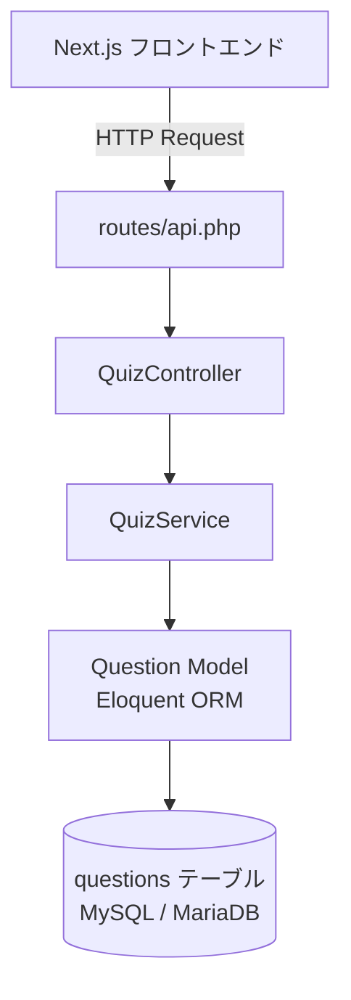
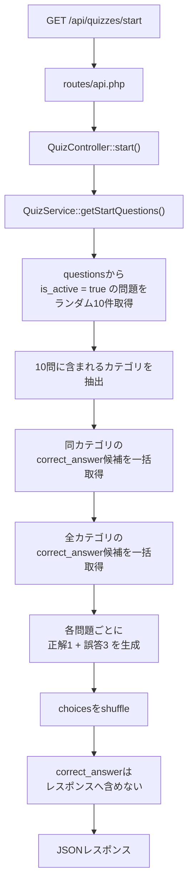
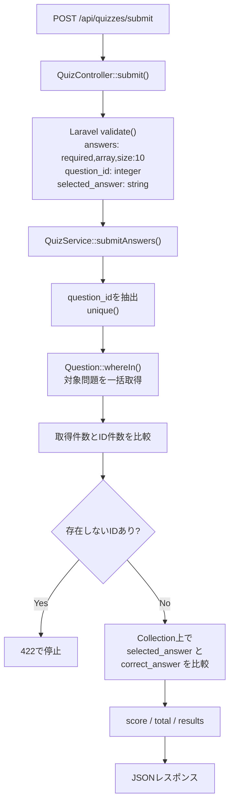
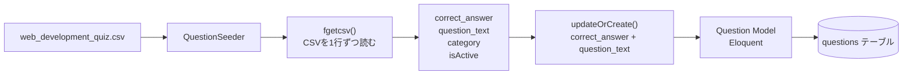
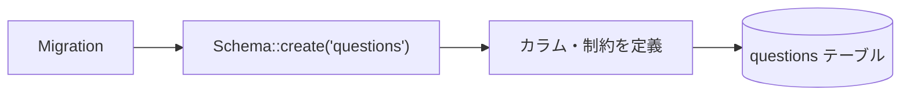
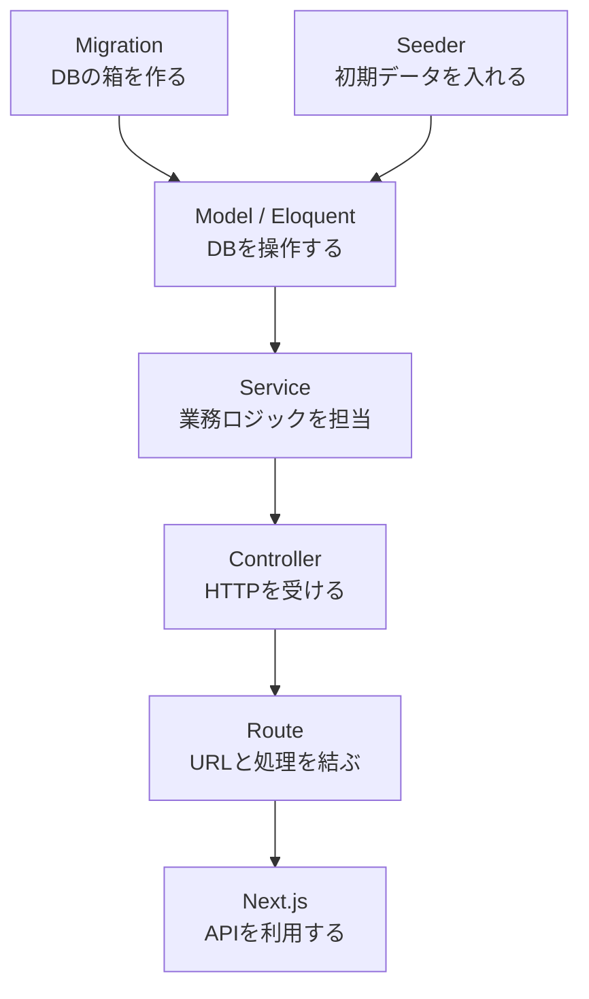
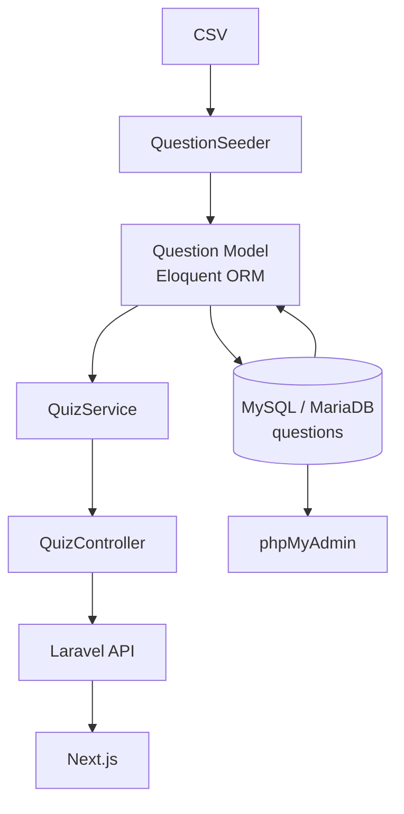

# LazyGenius Quiz API データフロー

対象リポジトリ：

`Leon20200809/lazygenius-quiz-api`

目的：

このドキュメントは、Laravel API内でデータがどのように流れるかを俯瞰するための設計資料です。

---

## 1. 全体像

まずは細かい処理を省き、クイズAPIの基本経路だけを見る。



基本の流れ：

```text
Next.js
↓
Route
↓
Controller
↓
Service
↓
Model / Eloquent
↓
Database
```

DBから取得した結果や採点結果は、この経路を逆方向へ戻り、最終的にJSONとしてNext.jsへ返る。

詳細な処理は後続の「クイズ開始API」「一括採点API」で分けて確認する。

### 対応する主なファイル

```text
routes/api.php
    ↓
app/Http/Controllers/Api/QuizController.php
    ↓
app/Services/QuizService.php
    ↓
app/Models/Question.php
    ↓
questions テーブル
```

### 各層の責務

```text
Route
→ URLとControllerを結ぶ

Controller
→ HTTPリクエストを受ける
→ バリデーションする
→ Serviceを呼ぶ
→ JSONレスポンスを返す

Service
→ クイズ取得
→ 誤答候補生成
→ 選択肢シャッフル
→ 一括採点
→ 得点・結果生成

Model
→ Eloquent ORMを通してDBへアクセスする

questionsテーブル
→ 問題データの実体を保存する
```

---

## 2. クイズ開始API

エンドポイント：

```text
GET /api/quizzes/start
```



フロントへ返す情報：

```text
id
question_text
category
choices
```

返さない情報：

```text
correct_answer
正解フラグ
DB内部の判定情報
```

---

## 3. 一括採点API

エンドポイント：

```text
POST /api/quizzes/submit
```



### N+1を避ける設計

```text
10件の回答
↓
question_idをまとめる
↓
whereIn()で1回にまとめて取得
↓
keyBy('id')
↓
Collection上で採点
```

---

## 4. CSVからquestionsテーブルへのデータ投入

対象：

```text
database/seeders/csv/web_development_quiz.csv
```

Seeder：

```text
database/seeders/QuestionSeeder.php
```



重複判定キー：

```text
correct_answer + question_text
```

同じ答えでも問題文が違えば別問題として扱う。

Seederを再実行しても、同じ組み合わせは重複登録せず更新対象となる。

---

## 5. Migrationから実DBまで

対象Migration：

```text
database/migrations/2026_06_04_014750_create_questions_table.php
```



questionsテーブル：

```text
id
correct_answer
question_text
category
is_active
created_at
updated_at
```

制約：

```text
PRIMARY KEY
→ id

UNIQUE
→ correct_answer + question_text
```

---

## 6. Laravelの各役割



```text
Migration
→ テーブル構造を作る

Seeder
→ 初期データをDBへ入れる

Model / Eloquent
→ PHPからDBを操作する

Service
→ データをどう使うか決める

Controller
→ HTTPを受けてServiceへ渡す

Route
→ URLとControllerを結ぶ

Next.js
→ Laravel APIを利用する
```

---

## 7. 実DB確認まで含めた全体像



学習上の確認ルート：

```text
Migration
↓
Seeder
↓
Eloquent ORM
↓
MySQL / MariaDB
↓
phpMyAdminで実物確認
```

---

## 8. 現在の主要ファイル

```text
routes/
└─ api.php

app/
├─ Http/
│  └─ Controllers/
│     └─ Api/
│        └─ QuizController.php
├─ Models/
│  └─ Question.php
└─ Services/
   └─ QuizService.php

database/
├─ migrations/
│  └─ 2026_06_04_014750_create_questions_table.php
└─ seeders/
   ├─ QuestionSeeder.php
   └─ csv/
      └─ web_development_quiz.csv
```

---

## 9. 最重要の一本線

```text
Next.js
↓
routes/api.php
↓
QuizController
↓
QuizService
↓
Question Model
↓
Eloquent ORM
↓
questions テーブル
```

逆方向：

```text
questions テーブル
↓
Eloquent ORM
↓
Question Model
↓
QuizService
↓
QuizController
↓
JSON
↓
Next.js
```

これが LazyGenius Quiz API の基本データフロー。
